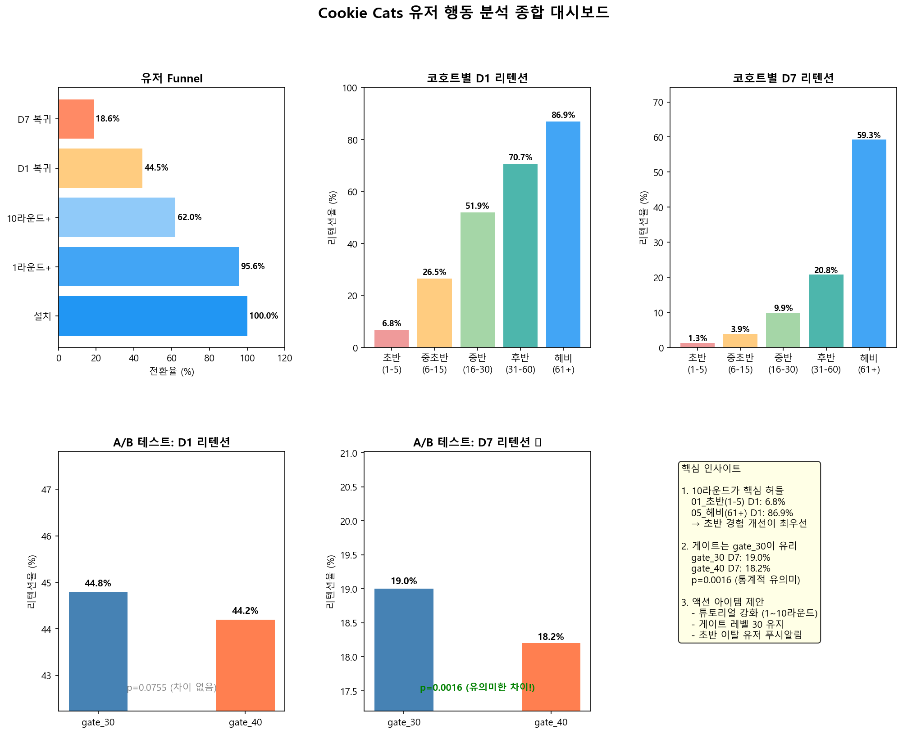

# Cookie Cats 유저 행동 분석

모바일 퍼즐 게임 **Cookie Cats**의 유저 행동 데이터를 분석하여 리텐션 개선 인사이트를 도출한 프로젝트입니다.

## 분석 목표

- 유저가 어느 단계에서 이탈하는지 파악 (Funnel)
- 플레이 패턴에 따른 리텐션 차이 분석 (Cohort)
- 게이트 위치 변경(30→40)이 리텐션에 미치는 영향 검증 (A/B Test)

## 데이터셋

| 항목 | 내용 |
|------|------|
| 파일 | `cookie_cats.csv` |
| 출처 | [Kaggle - Mobile Games A/B Testing](https://www.kaggle.com/datasets/mursideyarkin/mobile-games-ab-testing-cookie-cats) |
| 유저 수 | 약 90,000명 |
| 주요 컬럼 | `userid`, `version`, `sum_gamerounds`, `retention_1`, `retention_7` |

- `version`: 게이트 위치 (gate_30 / gate_40)
- `sum_gamerounds`: 설치 후 14일간 총 플레이 라운드 수
- `retention_1`: 설치 다음 날 재접속 여부
- `retention_7`: 설치 7일 후 재접속 여부

## 분석 구성

| 노트북 | 내용 |
|--------|------|
| [01_EDA.ipynb](notebooks/01_EDA.ipynb) | 데이터 탐색, 분포 확인, 유저 세그먼트 정의 |
| [02_funnel_analysis.ipynb](notebooks/02_funnel_analysis.ipynb) | 설치 → 플레이 → 리텐션 단계별 전환율 |
| [03_cohort_analysis.ipynb](notebooks/03_cohort_analysis.ipynb) | 플레이 횟수 기반 코호트별 리텐션 비교 |
| [04_ab_test.ipynb](notebooks/04_ab_test.ipynb) | 카이제곱 검정 및 신뢰구간으로 게이트 효과 검증 |
| [05_insight_summary.ipynb](notebooks/05_insight_summary.ipynb) | 종합 대시보드 및 액션 아이템 정리 |

## 주요 결과

### Funnel 분석
- 설치 후 **1라운드라도 플레이한 유저: 약 55%**
- **10라운드 이상** 도달 유저는 그보다 크게 줄어들며, 이 구간이 핵심 이탈 허들

### 코호트 분석
- 초반(1~5라운드) 유저는 D1 리텐션이 가장 낮음
- 헤비 유저(61라운드+)는 D1·D7 모두 압도적으로 높음
- **초반 경험 개선이 전체 리텐션에 가장 큰 영향**을 미침

### A/B 테스트
- **gate_30이 gate_40보다 D7 리텐션 높음**
- 카이제곱 검정 결과 **p < 0.05 → 통계적으로 유의미한 차이**
- D1 리텐션은 두 그룹 간 유의미한 차이 없음

### 최종 대시보드



## 액션 아이템

1. **튜토리얼 강화** — 1~10라운드 구간 이탈 방지
2. **게이트 레벨 30 유지** — D7 리텐션 기준 gate_30이 통계적으로 우수
3. **초반 이탈 유저 대상 푸시 알림** — D1 미복귀 유저에 재참여 유도

## 사용 기술

- Python 3.x
- pandas, numpy
- scipy (카이제곱 검정, 신뢰구간)
- matplotlib

## 실행 방법

```bash
pip install pandas numpy scipy matplotlib jupyter
```

노트북은 `01 → 02 → 03 → 04 → 05` 순서로 실행하세요.
